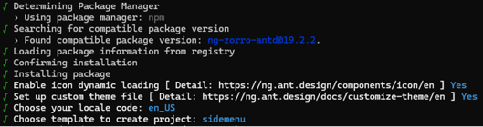
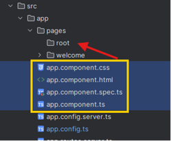
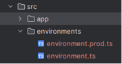
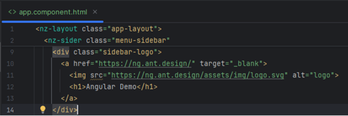

# 1.0 Introduction to Angular
This section will guide you on how to create a new Angular application using Angular CLI and restructure all files to make it organized by following Segregation of Concern approach.
Ng Zorro will be used as its component library.

---

## 1.1 Initialise demo application
1.	Open CMD in the target folder (to store source code)
2.	Install Angular CLI using ```npm install -g @angular/cli```
3.	Run ```ng new angular-demo-app```
   - Select CSS
   - Enable Server-Side Rendering - Y
   - Use Server Routing and App Engine APIs - N

---

## 1.2 Install Ant Design
Ref: https://ng.ant.design/docs/getting-started/en
1.	Open CMD from project folder (“cd angular-demo-app”)
2.	Run ```ng add ng-zorro-antd```
   - Proceed with installation - Y
   - Enable icon dynamic loading - Y
   - Set up custom theme file - Y
   - Chose en_US
   - Choose sidemenu template

     
3.	Test application by running ```ng serve```
4.	Open browser and navigate to http://localhost:4200

---

## 1.3 View source code in IDE
1.	Open Visual Studio Code / WebStorm
2.	Open folder
3.	Choose angular-demo-app folder

---

## 1.4 Restructure project files
1.	Create new folder inside ../src/app/pages/root
2.	Move all root components into root folder


3.	Create environments folder by running ```ng generate environments``` and duplicate development for prod:


4.	Update environment.ts in  ../src/environments with the following content:
```javascript
export const environment = {
    production: false,
    featureToggle: true,
    apiUrl: 'https://localhost:8081',
};
```

5.	Update environment.prod.ts in  ../src/environments with the following content:
```javascript 
export const environment = {
    production: true,
    featureToggle: false,
    apiUrl: 'https://api.example.com',
};
```

## 1.5 Check if the application updated successfully without restarting the service
1.	Open app.components.html in ../src/app/pages/root
2.	Update the following code and change the heading
```html
<h1>Ant Design of Angular</h1>
```


3.	Save the changes
4.	Navigate to http://localhost:4200 and check the updated content


