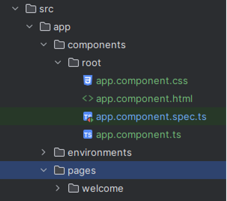
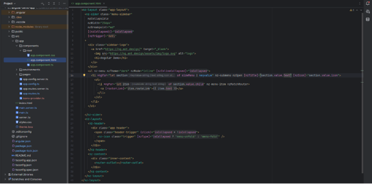
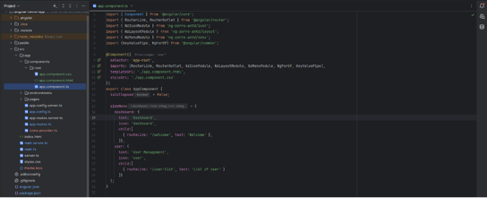
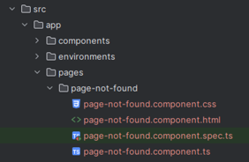
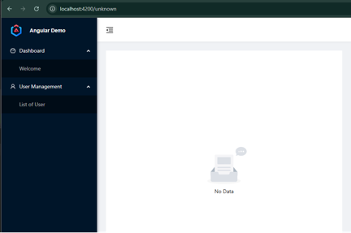
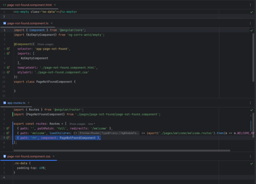
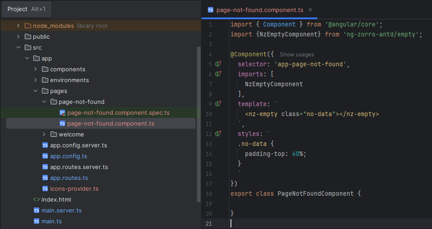

# 3.0 Angular Component & Template

---

## 3.1 Simplify side menu by loading it dynamically
1.	Create new folder inside ../src/app/components
2.	Move root folder from ../src/app/pages into ../src/app/components


3.	Open ../src/app/components/root/app.components.ts
4.	Add the following list of side menu inside export class
```javascript
sideMenu = {
    dashboard: {
      text: 'Dashboard',
      icon: 'dashboard',
      child:[
        { routeLink: '/welcome', text: 'Welcome' },
      ]},
    user: {
      text: 'User Management',
      icon: 'user',
      child:[
        { routeLink: '/user-list', text: 'List of User' }
      ]}
  };
```
5.	Open ../src/app/components/root/app.components.html
6.	Replace ```<ul>``` tag with the following code
```html
<ul nz-menu nzTheme="dark" nzMode="inline" [nzInlineCollapsed]="isCollapsed">
  <li *ngFor="let section of sideMenu | keyvalue" nz-submenu nzOpen [nzTitle]="section.value.text" [nzIcon]="section.value.icon">
    <ul>
      <li *ngFor="let item of section.value.child" nz-menu-item nzMatchRouter>
        <a [routerLink]="item.routeLink">{{ item.text }}</a>
      </li>
    </ul>
  </li>
</ul>
```

7.	Import all missing libraries
8.	Save all files and check if the changes are reflected on the browser
9.	Below are the full content of the component’s file:





---

## 3.2 Create new Page Not Found page component
1.	Open CMD from project folder and run ```ng generate component pages/page-not-found``` or ```ng g c pages/page-not-found --skip-tests=true```
2.	New set of component will be created with 3 main files (.html, .ts, .css)


3.	Open page-not-found.components.html and replace the file content with the following code:
```html 
<nz-empty class="no-data"></nz-empty>
```
4.	Import all missing libraries from page-not-found.components.html file
5.	Open app.routes.ts and update the route to make all unknown url to redirect to Page Not Found page. Make sure to put below code at the end of the list:
```json
{ path: '**', component: PageNotFoundComponent }
```
6.	Test random sub-path (e.g. http://localhost:4200/unknown) from browser and check if the following image displayed:


7.	Below are the full content of the code that needs to be updated:



---

## 3.3 Different way to write a component (.html & .css in one .ts)
1.	Open page-not-found.component.ts
2.	Copy the content of page-not-found.component.html and replace templateUrl value with it
3.	Change templateUrl with template
4.	Copy the content of page-not-found.component.css and replace styleUrl value with it
5.	Change styleUrl with styles
6.	Delete page-not-found.component.html & page-not-found.component.css file
7.	The final code will be as follows:



---

## 3.4 Create new Login page component
Ref: https://ng.ant.design/components/form/en#ng-content
1.	Open CMD from project folder and run ```ng g c pages/login --skip-tests=true```
2.	Paste the following code in the new login components:
```javascript
//login.component.ts
import { Component, inject } from '@angular/core';
import { NonNullableFormBuilder, ReactiveFormsModule, Validators } from '@angular/forms';

import { NzButtonModule } from 'ng-zorro-antd/button';
import { NzCheckboxModule } from 'ng-zorro-antd/checkbox';
import { NzFormModule } from 'ng-zorro-antd/form';
import { NzInputModule } from 'ng-zorro-antd/input';

@Component({
    selector: 'app-login',
    imports: [ReactiveFormsModule, NzButtonModule, NzCheckboxModule, NzFormModule, NzInputModule],
    templateUrl: './login.component.html',
    styleUrl: './login.component.css'
})
export class LoginComponent {
  private fb = inject(NonNullableFormBuilder);
  validateForm = this.fb.group({
    username: this.fb.control('', [Validators.required]),
    password: this.fb.control('', [Validators.required]),
    remember: this.fb.control(true)
  });
  
  submitForm(): void {
    if (this.validateForm.valid) {
        console.log('submit', this.validateForm.value);
    } else {
      Object.values(this.validateForm.controls).forEach(control => {
        if (control.invalid) {
          control.markAsDirty();
          control.updateValueAndValidity({ onlySelf: true });
        }
      });
    }
  }
}
```

```css
/* login.component.css */
.login-form {
max-width: 300px;
position: absolute;
top: 50%;
left: 50%;
margin-right: -50%;
transform: translate(-50%, -50%);
}

.login-form-margin {
margin-bottom: 16px;
}

.login-form-forgot {
float: right;
}

.login-form-button {
width: 100%;
}
```

```html
<!--login.component.html-->
<form nz-form [formGroup]="validateForm" class="login-form" (ngSubmit)="submitForm()">
  <nz-form-item>
    <nz-form-control nzErrorTip="Please input your username!">
      <nz-input-group nzPrefixIcon="user">
        <input type="text" nz-input formControlName="username" placeholder="Username" />
      </nz-input-group>
    </nz-form-control>
  </nz-form-item>
  <nz-form-item>
    <nz-form-control nzErrorTip="Please input your Password!">
      <nz-input-group nzPrefixIcon="lock">
        <input type="password" nz-input formControlName="password" placeholder="Password" />
      </nz-input-group>
    </nz-form-control>
  </nz-form-item>
  <div nz-row class="login-form-margin">
    <div nz-col [nzSpan]="12">
      <label nz-checkbox formControlName="remember">
        <span>Remember me</span>
      </label>
    </div>
    <div nz-col [nzSpan]="12">
      <a class="login-form-forgot">Forgot password</a>
    </div>
  </div>
  <button nz-button class="login-form-button login-form-margin" [nzType]="'primary'">Log in</button>
  Or
  <a>register now!</a>
</form>
```

---

## 3.5 Remove Side Menu from Root Component
1.	Open CMD and run ```ng g c components/menu```
2.	Transfer <nz-sider> code from ../app/components/root component
3.	Paste the following code in the new menu components:

```javascript
//menu.component.ts
import { Component } from '@angular/core';
import {RouterLink, RouterOutlet} from '@angular/router';
import {NzIconModule} from 'ng-zorro-antd/icon';
import {NzLayoutModule} from 'ng-zorro-antd/layout';
import {NzMenuModule} from 'ng-zorro-antd/menu';
import {KeyValuePipe, NgForOf} from '@angular/common';

@Component({
  selector: 'app-menu',
  imports: [RouterLink, RouterOutlet, NzIconModule, NzLayoutModule, NzMenuModule, NgForOf, KeyValuePipe],
  templateUrl: './menu.component.html',
  styleUrl: './menu.component.css'
})
export class MenuComponent {
  isCollapsed = false;
  
  sideMenu = {
    dashboard: {
      text: 'Dashboard',
      icon: 'dashboard',
      child:[
        { routeLink: '/welcome', text: 'Welcome' },
      ]
    },
    user: {
      text: 'User Management',
      icon: 'user',
      child:[
        { routeLink: '/user-list', text: 'List of User' }
      ]
    }
  };
}
```

```css
/* menu.component.css */
:host {
display: flex;
text-rendering: optimizeLegibility;
-webkit-font-smoothing: antialiased;
-moz-osx-font-smoothing: grayscale;
}

.app-layout {
height: 100vh;
}

.menu-sidebar {
position: relative;
z-index: 10;
min-height: 100vh;
box-shadow: 2px 0 6px rgba(0,21,41,.35);
}

.header-trigger {
height: 64px;
padding: 20px 24px;
font-size: 20px;
cursor: pointer;
transition: all .3s,padding 0s;
}

.trigger:hover {
color: #1890ff;
}

.sidebar-logo {
position: relative;
height: 64px;
padding-left: 24px;
overflow: hidden;
line-height: 64px;
background: #001529;
transition: all .3s;
}

.sidebar-logo img {
display: inline-block;
height: 32px;
width: 32px;
vertical-align: middle;
}

.sidebar-logo h1 {
display: inline-block;
margin: 0 0 0 20px;
color: #fff;
font-weight: 600;
font-size: 14px;
font-family: Avenir,Helvetica Neue,Arial,Helvetica,sans-serif;
vertical-align: middle;
}

nz-header {
padding: 0;
width: 100%;
z-index: 2;
}

.app-header {
position: relative;
height: 64px;
padding: 0;
background: #fff;
box-shadow: 0 1px 4px rgba(0,21,41,.08);
}

nz-content {
margin: 24px;
}

.inner-content {
padding: 24px;
background: #fff;
height: 100%;
overflow: auto;
}
```

```html
<!--menu.component.html-->
<nz-layout class="app-layout">
<nz-sider class="menu-sidebar"
nzCollapsible
nzWidth="256px"
nzBreakpoint="md"
[(nzCollapsed)]="isCollapsed"
[nzTrigger]="null"
>
    <div class="sidebar-logo">
      <a href="https://ng.ant.design/" target="_blank">
        
        <h1>Angular Demo</h1>
      </a>
    </div>
    <ul nz-menu nzTheme="dark" nzMode="inline" [nzInlineCollapsed]="isCollapsed">
      <li *ngFor="let section of sideMenu | keyvalue" nz-submenu nzOpen [nzTitle]="section.value.text" [nzIcon]="section.value.icon">
        <ul>
          <li *ngFor="let item of section.value.child" nz-menu-item nzMatchRouter>
            <a [routerLink]="item.routeLink">{{ item.text }}</a>
          </li>
        </ul>
      </li>
    </ul>

  </nz-sider>
  <nz-layout>
    <nz-header>
      <div class="app-header">
        <span class="header-trigger" (click)="isCollapsed = !isCollapsed">
          <nz-icon class="trigger" [nzType]="isCollapsed ? 'menu-unfold' : 'menu-fold'" />
        </span>
      </div>
    </nz-header>
    <nz-content>
      <div class="inner-content">
        <router-outlet></router-outlet>
      </div>
    </nz-content>
  </nz-layout>
</nz-layout>
```

4.	Below are the updated code for root component:
```javascript
//app.component.ts
import { Component } from '@angular/core';
import { NzIconModule } from 'ng-zorro-antd/icon';
import { NzLayoutModule } from 'ng-zorro-antd/layout';
import { NzMenuModule } from 'ng-zorro-antd/menu';
import {NgIf} from '@angular/common';
import {LoginComponent} from '../../pages/login/login.component';
import {MenuComponent} from '../menu/menu.component';

@Component({
  selector: 'app-root',
  imports: [NzIconModule, NzLayoutModule, NzMenuModule, LoginComponent, NgIf, MenuComponent],
  template: `
      <app-login *ngIf="!authorizedUser"></app-login>
      <app-menu *ngIf="authorizedUser"></app-menu>
    `
})
export class AppComponent {
    authorizedUser = true;
}
```

---

## 3.6 Apply @Input and @Output on User Listing page
1.	Create User Listing page component and search-bar and table-list components by running the following command in CMD:
```cmd 
ng g c pages/user-list
```
```cmd 
ng g c components/search-bar
```
```cmd 
ng g c components/table-list
```
2.	Update search-bar component with the following code:
```html
<!--search-bar.component.html-->
<div class="search-bar" style="margin-bottom: 24px;">
  <input
    nz-input
    [(ngModel)]="searchTerm"
    placeholder="Search users..."
    style="width: 300px; margin-right: 8px;"
  >
  <button
    nz-button
    nzType="primary"
    (click)="onSearch()"
    [disabled]="!searchTerm"
  >
    {{ buttonText }}
  </button>
</div>
```

```javascript
//search-bar.component.ts
import { Component, Input, Output, EventEmitter } from '@angular/core';
import { HttpClient } from '@angular/common/http';
import { NzInputModule } from 'ng-zorro-antd/input';
import { NzButtonModule } from 'ng-zorro-antd/button';
import { FormsModule } from '@angular/forms';

@Component({
  selector: 'app-search-bar',
  imports: [
    FormsModule,
    NzInputModule,
    NzButtonModule
  ],
  templateUrl: './search-bar.component.html',
  styleUrl: './search-bar.component.css'
})
export class SearchBarComponent {
  @Input() buttonText = 'Search';
  @Input() apiUrl = '';
  @Output() searchResults = new EventEmitter<any>();
  @Output() error = new EventEmitter<any>();
  
  searchTerm = '';
  
  constructor(private http: HttpClient) {}
  
  onSearch() {
  if (!this.searchTerm || !this.apiUrl) return;
  
      const url = `${this.apiUrl}?q=${encodeURIComponent(this.searchTerm)}`;
  
      this.http.get(url).subscribe({
        next: (res: any) => this.searchResults.emit(res.users),
        error: (err) => this.error.emit(err)
      });
  }
}
```

3.	Update table-list component with the following code:
```html
<!--table-list.component.html-->
<nz-table
    #basicTable
    [nzData]="data"
    [nzPageSize]="10"
    nzShowSizeChanger
    style="margin-top: 24px;"
>
  <thead>
  <tr>
    <th *ngFor="let col of columns">{{ col.displayText }}</th>
  </tr>
  </thead>
  <tbody>
  <tr *ngFor="let item of basicTable.data">
    <td *ngFor="let col of columns">{{ item[col.fieldName] }}</td>
  </tr>
  </tbody>
</nz-table>
```

```javascript
//table-list-component.ts
import {Component, Input} from '@angular/core';
import {NzTableModule} from 'ng-zorro-antd/table';
import {NgForOf} from '@angular/common';

@Component({
  selector: 'app-table-list',
  imports: [
    NzTableModule,
    NgForOf
  ],
  templateUrl: './table-list.component.html',
  styleUrl: './table-list.component.css',
  host: {ngSkipHydration: 'true'}
})
export class TableListComponent {
    @Input() data: any[] = [];
    @Input() columns: { fieldName: string; displayText: string }[] = [];
}
```


4.	Use both of search-bar & table-list component in user-list component:
```html
<!--user-list.component.html-->
<nz-card nzTitle={{pageTitle}}>
<app-search-bar
    [buttonText]="'Search Users'"
    [apiUrl]="apiUrl"
    (searchResults)="onSearchResults($event)"
    (error)="onSearchError($event)"
></app-search-bar>

<app-table-list
[data]="tableData"
[columns]="columns"
></app-table-list>
</nz-card>
```

```javascript
//user-list.component.ts
import { Component } from '@angular/core';
import {SearchBarComponent} from '../../components/search-bar/search-bar.component';
import {NzCardComponent} from 'ng-zorro-antd/card';
import {TableListComponent} from '../../components/table-list/table-list.component';

@Component({
  selector: 'app-user-list',
  imports: [
    SearchBarComponent,
    NzCardComponent,
    TableListComponent
  ],
  templateUrl: './user-list.component.html',
  styleUrl: './user-list.component.css'
})
export class UserListComponent {
  pageTitle = 'List of Users';
  apiUrl = 'https://dummyjson.com/users/search';
  tableData: any[] = [];
  columns = [
    { fieldName: 'firstName', displayText: 'First Name' },
    { fieldName: 'lastName', displayText: 'Last Name' },
    { fieldName: 'email', displayText: 'Email' },
    { fieldName: 'phone', displayText: 'Phone' }
  ];
  
  onSearchResults(data: any[]) {
    this.tableData = data;
  }
  
  onSearchError(error: any) {
    console.error('Search error:', error);
  }
}
```
5. To load User Listing page, update app.routes.ts and add the following code before PageNotFound router:
```javascript
  { path: 'user-list', component: UserListComponent },
```
6. Save all files and 
